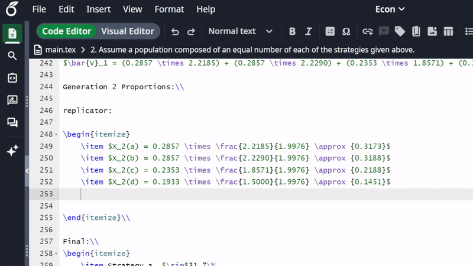

# Overleaf Math AutoComplete

A lightweight Chrome extension that adds real-time math computation and autocompletion to the Overleaf editor.

## Features

- **Real-time Evaluation**: Automatically calculates math expressions as you type `=`.
- **LaTeX Support**: Handles common LaTeX commands like `\frac{num}{den}`, `\cdot`, `\times`, `\sqrt{}` and more.
- **Smart Context**: 
  - Detects if you are inside a math block and suggests the closing `$`.
  - Ignores variable assignments (e.g., in `x = 5 * 2 =`, it only evaluates `5 * 2`).
- **Non-Intrusive UI**: Shows a gray suggestion next to the cursor that doesn't overlap with your text.
- **CSP-Safe**: Includes a custom recursive descent parser to bypass Overleaf's strict Content Security Policy (no `eval` or `new Function`).
- **One-Key Autocomplete**: Press **Tab** to instantly insert the result.

## Installation

1. Clone this repository or download the source code.
2. Open Google Chrome and navigate to `chrome://extensions`.
3. Enable **Developer mode** in the top right corner.
4. Click **Load unpacked** and select the extension folder.
5. Refresh your Overleaf project page.

## Usage

1. Open a LaTeX document in Overleaf.
2. Type a mathematical expression followed by an equals sign `=`.
   - Example: `\frac{1}{4}(3 + 1.75 + 1 + 1) =`
3. A gray suggestion (e.g., `1.6875$`) will appear next to your cursor.
4. Press **Tab** to accept the suggestion.
5. Press any other key to dismiss it.

## Technical Details

- **Editor Integration**: Uses a `MutationObserver` and DOM analysis to interact with Overleaf's CodeMirror 6 editor.
- **Math Engine**: A custom-built, recursive descent parser in JavaScript that tokenizes and evaluates arithmetic expressions safely.

## License

MIT
